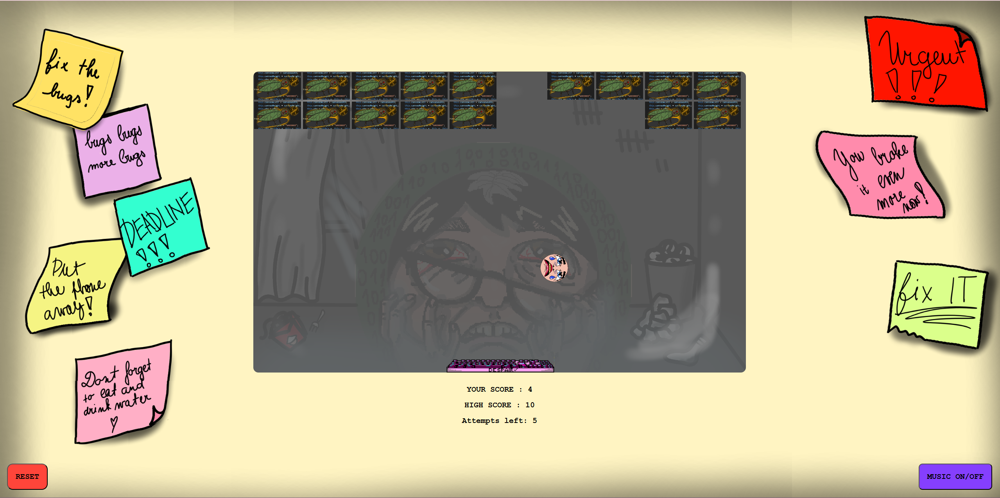
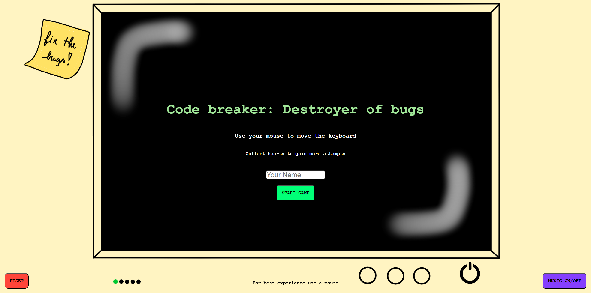
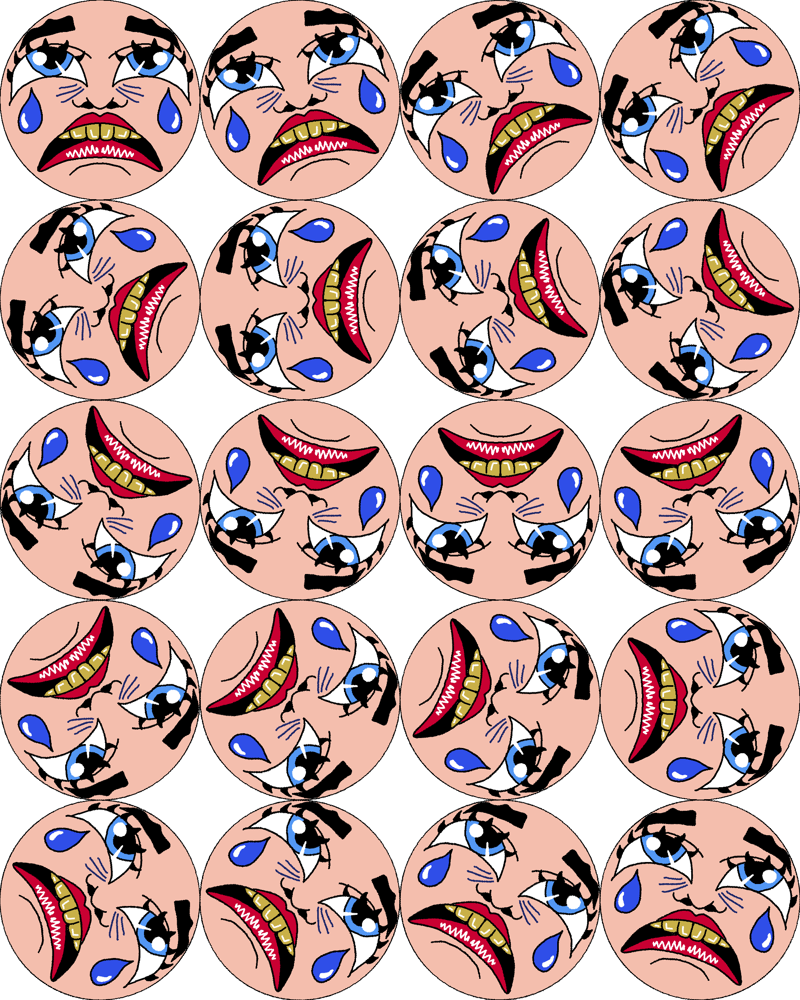
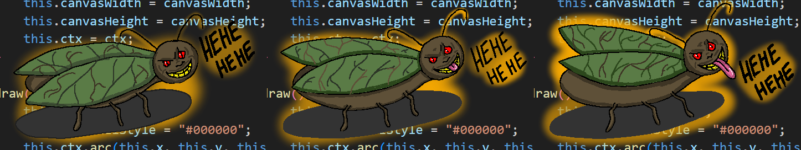

# 🎮 Code Breaker: Destroyer of Bugs

> **Short Pitch**: A relatable twist on the classic Breakout-style gameplay. Inspired by the struggles of debugging, use the keyboard to reflect your desperate face and squash all bugs.

---

## 🌐 Play the Game
[Click here to play the game!](https://irisjpeg.github.io/CCL1/)

---

## 📸 Screenshots

### Main Gameplay:

  
  
*Figure 1: Example of gameplay in action.*

### UI:

  
  
*Figure 2: Menu and user interface.*

## 🎨 Spritesheets
Below are the sprites used to create characters and objects in the game:

### Ball sprites:

  
  
*Figure 3: Ball animation.*

### Paddle sprites:

  
  
*Figure 4: Paddle animation.*

### Obstacle-Bugs sprites:

  
  
*Figure 4: Bug animation.*

---

## ✍️ Reflection

### What Went Well
- **Reflection angles from paddle**: Adding different reflection angles based on the place of collision on the paddle gave the game needed sence of skill.
- **Hearts for Extra Tries**: Introducing heart pickups gave players more chances to win the game.
- **Visuals**: I enjoyed giving my game a goofy representation and I think I have succeeded.

### Challenges
- **Debugging**: Debugging my code, especially dealing with collision bugs and unexpected ball behaviours.
- **Game progression**: Trying to find a way to make each level a bit harder, without making it too difficult.

### Lessons Learned
- **Incremental Design**: Starting with a minimal Breakout game and gradually adding features (hearts, velocity boosts, additional rows) helped keep the code functional as I progressed.
- **User-Focused Iteration**: Letting my friends play the game helped me determine the right difficulty, as after testing it my self 1000 times my opinion was biased.
---

Happy Bug Hunting! 🐛🪓
